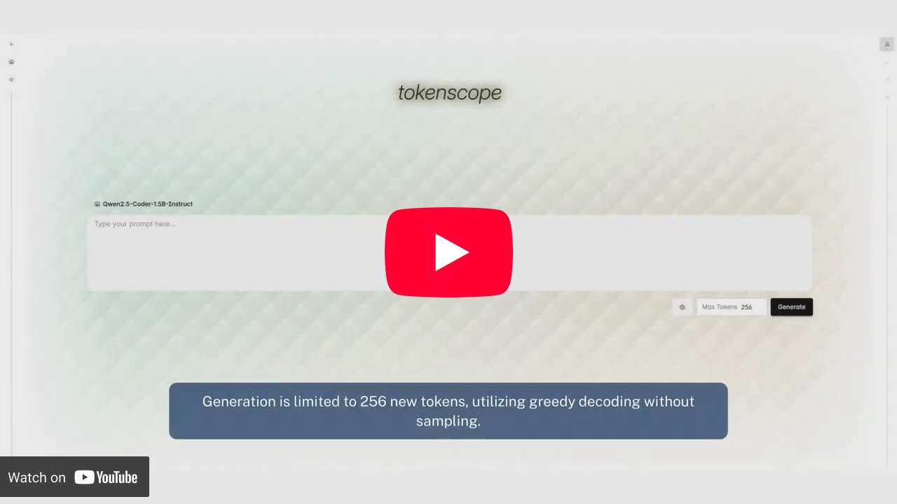

# TokenScope

TokenScope is an explainability, interpretability, and analysis tool for large language models, designed to expose token-level signals during text and code generation.

It enables interactive inspection of decoding-time uncertainty, attention patterns, alternative token candidates, and counterfactual generation paths, with a particular focus on LLM-based code generation.

TokenScope is intended for researchers studying LLM behavior and practitioners debugging or auditing model-generated text and code.

<p align="center">
  <a href="https://www.youtube.com/watch?v=HI1L1X9LruQ">
    
  </a>
</p>

## Getting Started

### Docker

Using docker is the recommended way to get started with TokenScope:

```Bash
git clone https://github.com/Amirresm/tokenscope.git
cd tokenscope
docker build -t tokenscope .
docker run -v /path/to/model_directory:/models -p 3000:3000 -p 4000:4000 --gpus all tokenscope
```

- TokenScope can run models on CPU (skip passing `--gpus all`).
- Hugging Face models are supported.
- `/path/to/model_directory` must be a directory containing Hugging Face models. TokenScope will discover all models within this directory recursively.

## Usage

- Download model weight into your `model_directory` (e.g. using `hf download ...`)
- Start the server.
- Open the web interface at `localhost:3000`.
    - Select a model from the model management menu.
    - Enter a prompt and configure decoding or analysis settings.
    - Generate output and inspect token-level metrics, attention, and alternatives.
    - Interactively branch or replace tokens to explore counterfactual generations.
    - Switch to code analysis mode to view AST-aligned metrics.

## Metrics

TokenScope exposes multiple decoding-time signals, including:

- Token confidence and margin confidence
- Entropy
- Token surprisal
- Sequence perplexity
- Attention weights

<!-- Refer to the paper for formal definitions. -->

## Limitations

- TokenScope requires access to token probabilities and attention weights and is therefore not compatible with closed or heavily abstracted APIs.
- Code-aware analysis currently supports Python and depends on Tree-Sitter parsers.
- The system is designed for evaluation and analysis, not production inference, and incurs significant overhead.

## License

This project is licensed under the MIT License - see the LICENSE file for details

## Acknowledgments

TokenScope builds on the Hugging Face ecosystem and Tree-Sitter for parsing and analysis.
